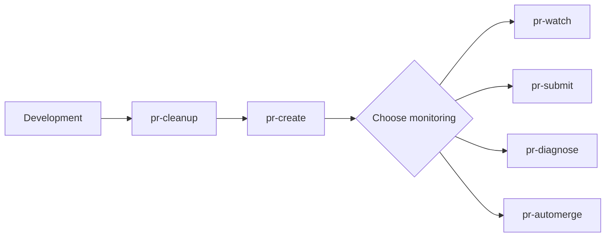

# Claude Commands Index

Complete reference of all Claude commands with relationships.

## Quick Navigation

### By Category

- [[#Global Commands]]
- [[#sf-ui-web Commands]]
- [[#Other Repository Commands]]
- [[#External Tools]]

### By Use Case

- [[#PR Workflow]]
- [[#Validation]]
- [[#Monitoring]]
- [[#Cross-Repo Testing]]
- [[#Utilities]]

---

## Global Commands

Commands that work in any repository.

| Command | Purpose | Key Relationships |
|---------|---------|-------------------|
| [[commands]] | Show available commands | Discovery tool |
| [[buffers]] | Fetch Neovim buffers | Standalone utility |
| [[create-command]] | Generate new command | Meta command |
| [[cherry-pick-merge]] | Cherry-pick workflow | Git utility |
| [[pr-template]] | Generate PR description | Used by [[pr-create]] |
| [[pr-create]] | Create PR workflow | Uses [[pr-template]], [[pr-check]] |
| [[pr-watch]] | Monitor PR CI | Used by [[pr-submit]], [[pr-diagnose]], [[pr-automerge]] |
| [[pr-dashboard]] | View all PRs | Dashboard view |
| [[buildkite-watch]] | Monitor Buildkite builds | Used by prepublish commands |

---

## sf-ui-web Commands

Commands specific to sf-ui-web repository.

| Command | Purpose | Key Relationships |
|---------|---------|-------------------|
| [[pr-cleanup]] | Prepare branch for PR | Suggests [[pr-template]], [[pr-create]] |
| [[quick-rebuild]] | Fast codegen + build | Used by [[pr-cleanup]] |
| [[pr-check]] | Full validation suite | Used by [[pr-create]], [[pr-submit]] |
| [[pr-submit]] | Validation + watch | Uses [[pr-check]], [[pr-watch]] |
| [[pr-diagnose]] | Watch + diagnose | Uses [[pr-watch]], suggests [[pr-check]] |
| [[pr-automerge]] | Watch + auto-merge | Uses [[pr-watch]] |

---

## Other Repository Commands

| Command | Repository | Purpose | Key Relationships |
|---------|-----------|---------|-------------------|
| [[prepublish-block-builder-api]] | block-builder-api | Test schema changes | Uses [[buildkite-watch]] |
| [[prepublish-sf-js-libraries]] | sf-js-libraries | Test library changes | Uses [[buildkite-watch]] |
| [[dev]] | Any | Show dev CLI commands | Discovery tool |
| [[archive-week]] | notes | Archive weekly plan | Standalone utility |

---

## External Tools

Underlying CLIs wrapped by commands.

### dev CLI

**Location:** `~/dotfiles/scripts/dev/dev.sh`

**Used By:**
- [[pr-check]] → `dev :run pr:check`
- [[pr-submit]] → `dev :run pr:submit`
- [[pr-diagnose]] → `dev :run pr:diagnose`
- [[pr-automerge]] → `dev :run pr:automerge`
- [[quick-rebuild]] → `dev :run quick`

### scout CLI

**Location:** `~/codebase/scout`

**Used By:**
- [[pr-watch]] → `scout check`
- [[pr-dashboard]] → `scout pr-dashboard`
- [[buildkite-watch]] → monitoring scripts

### gh CLI

**Used By:**
- [[pr-create]] - Create PR
- [[pr-watch]] - PR status
- [[pr-automerge]] - Merge PR
- [[buildkite-watch]] - PR detection
- [[commands]] - PR detection

---

## PR Workflow

Complete PR workflow from development to merge.



### Step-by-Step

1. **Development Phase**
   - Make changes
   - Run [[pr-cleanup]] to prepare branch

2. **PR Creation**
   - Run [[pr-create]]
     - Optionally runs [[pr-check]]
     - Uses [[pr-template]] for description
     - Pushes and creates PR

3. **Monitoring Phase** (choose one)
   - [[pr-watch]] - Basic monitoring
   - [[pr-submit]] - Validation + monitoring
   - [[pr-diagnose]] - Monitoring + AI diagnosis
   - [[pr-automerge]] - Monitoring + auto-merge

---

## Validation

Commands focused on code validation.

| Command | Type | What It Validates |
|---------|------|------------------|
| [[pr-check]] | sf-ui-web | format, lint, typecheck, build, test |
| [[pr-submit]] | sf-ui-web | Same as pr-check + CI monitoring |
| [[quick-rebuild]] | sf-ui-web | codegen, build only |

---

## Monitoring

Commands that monitor external services.

| Command | Monitors | Reused By |
|---------|----------|-----------|
| [[pr-watch]] | GitHub PR CI checks | [[pr-submit]], [[pr-diagnose]], [[pr-automerge]] |
| [[buildkite-watch]] | Buildkite builds | [[prepublish-block-builder-api]], [[prepublish-sf-js-libraries]] |
| [[pr-dashboard]] | All PRs in repo | Standalone |

---

## Cross-Repo Testing

Commands for testing changes across repositories.

| Command | Source Repo | Target Repo | Uses |
|---------|------------|-------------|------|
| [[prepublish-block-builder-api]] | block-builder-api | sf-ui-web | [[buildkite-watch]] |
| [[prepublish-sf-js-libraries]] | sf-js-libraries | consuming repos | [[buildkite-watch]] |

---

## Utilities

Standalone utility commands.

| Command | Purpose | Context |
|---------|---------|---------|
| [[commands]] | Show available commands | Any repo |
| [[buffers]] | Fetch Neovim buffers | Neovim integration |
| [[create-command]] | Generate new command | Meta |
| [[cherry-pick-merge]] | Cherry-pick workflow | Git |
| [[pr-template]] | Generate PR description | Manual or via [[pr-create]] |
| [[pr-dashboard]] | View all PRs | Any repo |
| [[dev]] | Show dev CLI commands | Any repo |
| [[archive-week]] | Archive weekly plan | notes repo |

---

## Command Reuse Patterns

### pr-watch (Reused by 3 commands)

```
pr-watch ← pr-submit
        ← pr-diagnose
        ← pr-automerge
```

- [[pr-submit]] - Validation + watch
- [[pr-diagnose]] - Watch + diagnose
- [[pr-automerge]] - Watch + auto-merge

### buildkite-watch (Reused by 2 commands)

```
buildkite-watch ← prepublish (block-builder-api)
                ← prepublish (sf-js-libraries)
```

- [[prepublish-block-builder-api]] - Schema testing
- [[prepublish-sf-js-libraries]] - Library testing

### pr-check (Reused by 2 commands)

```
pr-check ← pr-create (optional)
         ← pr-submit (included)
```

- [[pr-create]] - Optional pre-flight validation
- [[pr-submit]] - Included in workflow

---

## Architecture

```
┌─────────────────────────────────────────┐
│ Layer 1: Claude Commands                │
│ High-level workflows and orchestration  │
└─────────────────────────────────────────┘
              ↓ uses
┌─────────────────────────────────────────┐
│ Layer 2: CLI Tools                      │
│ dev CLI, scout CLI, monitoring scripts  │
└─────────────────────────────────────────┘
              ↓ uses
┌─────────────────────────────────────────┐
│ Layer 3: Platform APIs                  │
│ gh CLI, git, yarn                       │
└─────────────────────────────────────────┘
```

### Layer 1: Claude Commands (Orchestration)

Commands that orchestrate multi-step workflows:
- [[pr-create]] - Orchestrates validation, template, push, create
- [[pr-cleanup]] - Orchestrates git, build, format workflow
- [[pr-submit]] - Orchestrates validation + monitoring
- [[pr-diagnose]] - Orchestrates monitoring + diagnosis
- [[pr-automerge]] - Orchestrates monitoring + merge
- [[prepublish-block-builder-api]] - Orchestrates publish + monitor
- [[prepublish-sf-js-libraries]] - Orchestrates publish + monitor

### Layer 2: CLI Tools (Implementation)

Reusable components and external tools:
- dev CLI - Context-aware development commands
- scout CLI - GitHub/Buildkite automation
- Monitoring scripts - Buildkite polling and progress

### Layer 3: Platform APIs (Low-level)

Direct platform interactions:
- gh CLI - GitHub API
- git - Version control
- yarn - Package management

---

## Tags Reference

- `#global` - Works in any repository
- `#sf-ui-web` - Specific to sf-ui-web
- `#block-builder-api` - Specific to block-builder-api
- `#sf-js-libraries` - Specific to sf-js-libraries
- `#notes` - Specific to notes repo
- `#pr-workflow` - Part of PR workflow
- `#validation` - Code validation
- `#monitoring` - External service monitoring
- `#reusable-component` - Used by multiple commands
- `#orchestration` - Multi-step workflow
- `#composite-command` - Combines multiple commands
- `#discovery` - Help/discovery tool
- `#utility` - Standalone utility
- `#meta` - Command about commands
